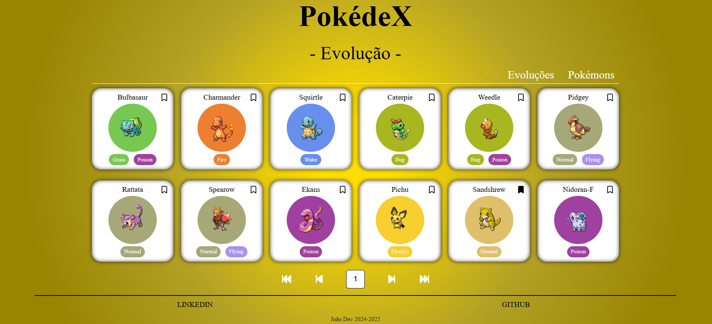
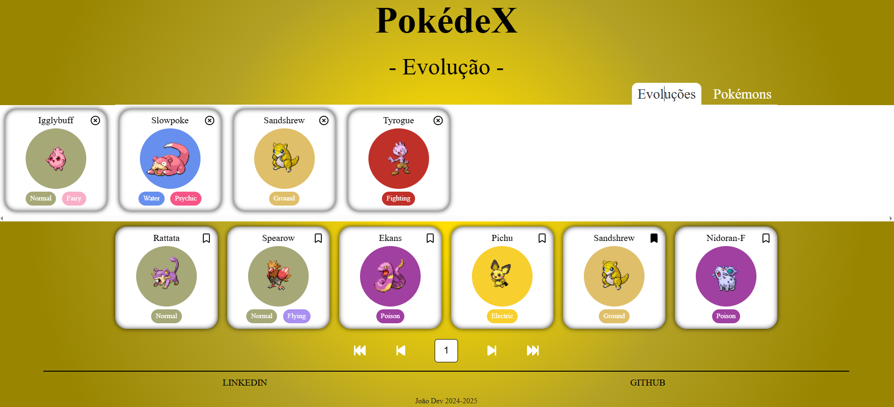
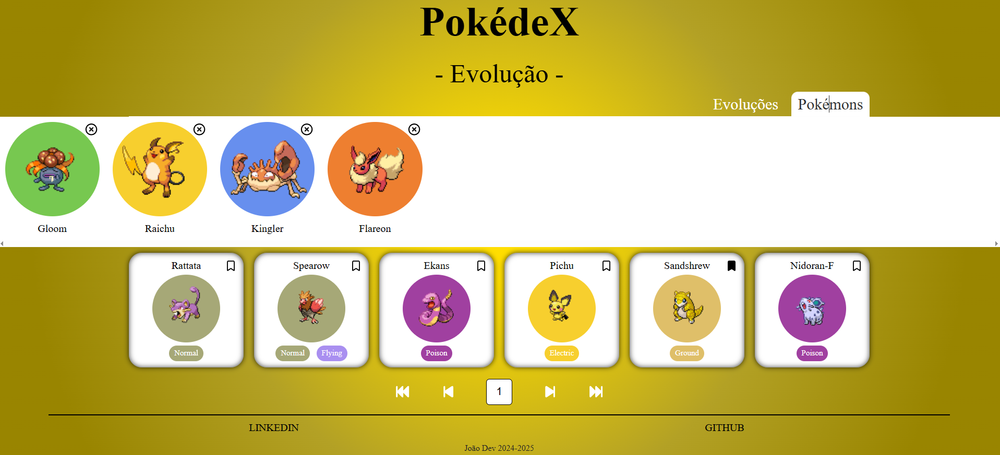
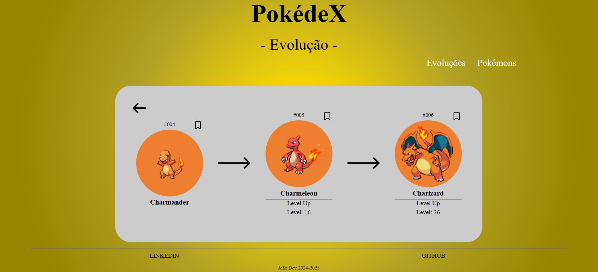
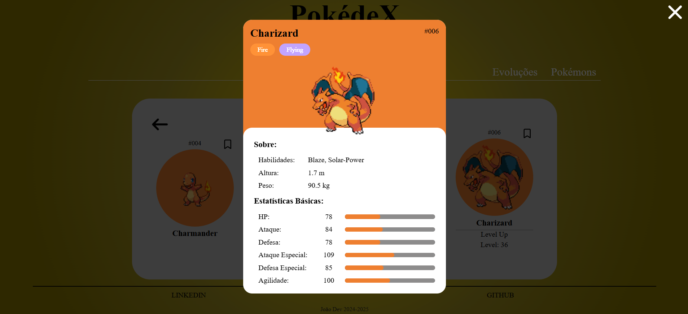

# 🐉 Pokedex de Evoluções

Uma aplicação web interativa desenvolvida com **React + TypeScript**, que exibe as **evoluções dos Pokémon** e como cada um deles evolui.
Os dados são obtidos em tempo real através da **API pública [PokeAPI](https://pokeapi.co/)**.

---

## 💡 Sobre o Projeto

O **Pokedex de Evoluções** foi desenvolvido com o objetivo de oferecer uma forma prática e visual de explorar as **cadeias evolutivas dos Pokémon**, exibindo detalhes sobre **como cada Pokémon evolui** e **quais são suas formas evoluídas**.

Este projeto é **ideal para jogadores dos jogos de Pokémon**, pois é muito comum que os treinadores não saibam:

* se um Pokémon **possui evolução**,
* **como** realizar sua evolução, ou
* **quais itens ou condições** são necessários para que ela aconteça.

É nesse ponto que este projeto se torna **essencial**: ele ajuda os jogadores a obter **informações claras e acessíveis** sobre as evoluções dos Pokémon, tornando a experiência de jogo mais completa e estratégica.

Além disso, o sistema permite que o usuário **crie listas personalizadas de favoritos**, tanto de **Pokémon individuais** quanto de **cadeias evolutivas completas**, com todos os dados armazenados no **Local Storage** do navegador.

A aplicação é **totalmente responsiva**, desenvolvida com a metodologia **Mobile First**, garantindo uma navegação fluida e intuitiva em qualquer dispositivo.

---

## 🎮 Público-Alvo e Benefícios

Este projeto foi pensado especialmente para **treinadores e fãs dos jogos da franquia Pokémon**.
Muitos jogadores, principalmente os iniciantes, encontram dificuldade em descobrir:

* quais Pokémon evoluem e quais não;
* quais **níveis, condições, amizades ou itens** são necessários para a evolução;
* como planejar uma equipe baseada em **linhas evolutivas estratégicas**.

A **Pokedex de Evoluções** resolve esses problemas ao apresentar uma **interface intuitiva**, que concentra todas essas informações de forma visual e organizada.

### 🧩 Benefícios:

* 🔍 Facilita a descoberta de novas evoluções;
* ⚡ Melhora o planejamento de equipes nos jogos;
* 💾 Permite salvar Pokémon e evoluções favoritas localmente;
* 🧠 Ajuda na compreensão das mecânicas de evolução da franquia;
* 📱 Pode ser acessada facilmente em qualquer dispositivo.

Com isso, o projeto se torna não apenas uma ferramenta de estudo e curiosidade, mas também um **apoio prático para jogadores** que buscam otimizar suas jornadas como treinadores Pokémon.

---

## 🧭 Funcionalidades Principais

### 🏠 Tela Inicial

* Exibe um **menu de favoritos** com duas opções:

  * **Evoluções Favoritas**
  * **Pokémons Favoritos**

* O menu é do tipo **drop-down**, permitindo expandir e recolher cada categoria.
* Caso o usuário ainda não tenha favoritado nenhum item (ou tenha excluído todos), são exibidas as mensagens:

  * 🧩 “Adicione uma Evolução!”
  * ⚡ “Adicione um Pokémon!”

---

### 💖 Favoritos

* Os **cards de evoluções** e **Pokémon favoritos** são armazenados no **Local Storage**.
* É possível:

  * **Visualizar** detalhes das evoluções ou estatísticas do Pokémon;
  * **Remover** cards da lista de favoritos.

---

### 🔄 Listagem de Evoluções

* São exibidos **12 cards por página** no **desktop** e **8 cards no mobile**.
* Cada card contém:

  * Nome do pokémon
  * Uma imagem do pokémon com um fundo redendo com a cor do tipo principal do pokémon;
  * Botão para **favoritar**;
  * Ação para **ver detalhes do pokémon**.

* Ao clicar em um card, o usuário é redirecionado para a **página de detalhes** da evolução.

---

### 📄 Paginação

* Abaixo dos cards, há um **menu de navegação** com os seguintes controles:

  * ⏮️ Primeira página
  * ◀️ Página anterior
  * ▶️ Próxima página
  * ⏭️ Última página

* No centro, há um **input numérico** que exibe o número da página atual, permitindo também a **navegação manual**.
* O **número da página atual** é salvo no **Local Storage**, garantindo que, ao recarregar o site, o usuário continue de onde parou.

---

### 🧬 Página de Evolução

* Possui o mesmo **menu de favoritos** da página inicial.
* Exibe:

  * A **cadeia de evolução completa**;
  * Os **Pokémon envolvidos** com as **condições de evolução**.

* É possível:

  * **Favoritar Pokémon** não favoritados;
  * **Visualizar as estatísticas** de cada Pokémon.

* Cada página é carregada de acordo com o **ID da evolução** passado via **query string** na URL.

---

## 🧱 Tecnologias Utilizadas

* ⚛️ **React + TypeScript** — Biblioteca principal com tipagem estática para maior segurança e escalabilidade do código.
* 💅 **styled-components** — Estilização com CSS-in-JS, permitindo componentes reutilizáveis e dinâmicos.
* 🌐 **axios** — Cliente HTTP utilizado para consumir a [PokeAPI](https://pokeapi.co/).
* 🧭 **react-router-dom** — Gerenciamento de rotas e navegação entre as páginas.
* ⭐ **FontAwesome** — Biblioteca de ícones utilizada para compor a interface.
* 💾 **Local Storage** — Armazenamento local dos favoritos e do estado da página.

---

## 📱 Responsividade

O layout foi desenvolvido com foco em **usabilidade e experiência do usuário em dispositivos móveis**.
Utiliza técnicas de **mobile first**, garantindo adaptação fluida entre smartphones, tablets e desktops.

---

## 🚀 Como Executar o Projeto

1. **Clone o repositório:**

   ```bash
   git clone https://github.com/Dev-JoaoSouza/pokedex-evolucoes-reactts.git
   ```

2. **Acesse a pasta do projeto:**

   ```bash
   cd pokedex-evolucoes-reactts
   ```

3. **Instale as dependências:**

   ```bash
   npm install
   ```

4. **Execute o projeto:**

   ```bash
   npm run dev
   ```

5. **Acesse no navegador:**

   ```
   http://localhost:3000
   ```

---

## 📸 Demonstração


Página Inicial


Evolução Favoritas


Pokemons Favoritos


Página de Evolução


Detalhes do Pokémon

---

## 🧑‍💻 Autor

**João Dev**
📎 [LinkedIn](https://www.linkedin.com/in/joaosouza-dev/) | 💻 [GitHub](https://github.com/Dev-JoaoSouza/)

---

## 🐾 Agradecimentos

* API disponibilizada por [PokeAPI.co](https://pokeapi.co/)
* Comunidade React e todos os desenvolvedores que inspiram o aprendizado contínuo ⚛️
* Fãs e jogadores Pokémon, que tornam o universo ainda mais empolgante 🌟